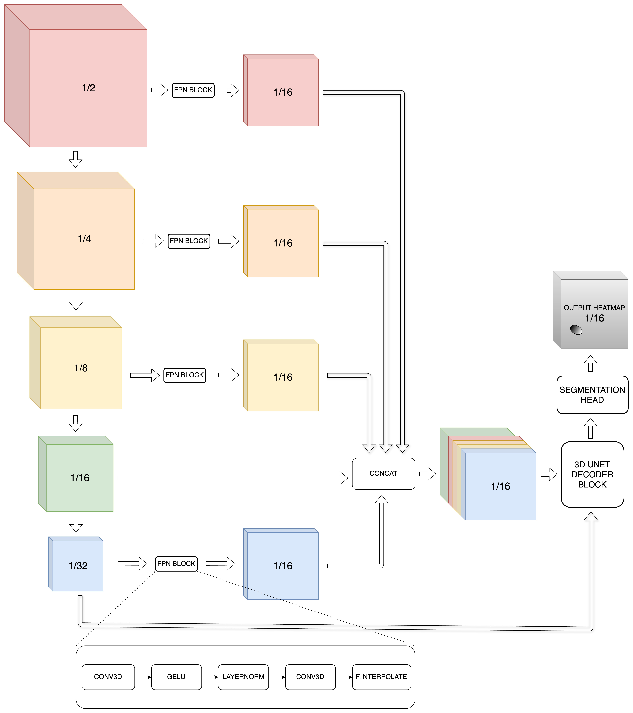

3rd place solution of the [BYU - Locating Bacterial Flagellar Motors 2025](https://www.kaggle.com/competitions/byu-locating-bacterial-flagellar-motors-2025) competition on Kaggle

Solution writeup: [3rd place solution: 3D/2D UNet with Gaussian Heatmap and WBF](https://www.kaggle.com/competitions/byu-locating-bacterial-flagellar-motors-2025/discussion/583380)


## Table Of Contents
- [Table Of Contents](#table-of-contents)
- [Solution Summary](#solution-summary)
- [Hardware](#hardware)
- [Installation](#installation)
- [Data Setup](#data-setup)
- [Solution Reproducing](#solution-reproducing)


## Solution Summary
- Focus on the 3D/2.5D/2D UNet approaches. The final submission PB 86.6 was an ensemble of 5 models: 3D Resnext50 (2xTTA), 3D Densenet121 (2xTTA), 3D X3D-M (2xTTA), 2D MaxViT (2xTTA) and 2D CoaT (1xTTA)
3D model use patch size of (224, 448, 448) while 2D use (3, 896, 896) patch size to incorporate enough global context.
- Gaussian heatmap with stride=16 and sigma=200A for uncertainty modeling
- Simple FPN neck to fuse low-level features into stride-16-feature map
- All final selected models are trained on combine of train dataset + external dataset without local validation
- Heavy augmentations allowed to train for more epochs and be more robust to domain/distribution change.
- Pseudo labeling on train+external dataset, with manual review
- Resample all tomograms to 16A voxel spacing + Sliding window patches inference
- Simple BCE loss works best
- Weighted Box Fusion (WBF) to ensemble multiple model/TTA ’s predictions




## Hardware

Different machines equipped with different GPUs (NVIDIA T4, A30, L40S, A100 40GB) were used. However, almost experiments are conducted using single [L40S 48GB GPU](https://resources.nvidia.com/en-us-l40s/l40s-datasheet-28413?ncid=no-ncid).
Different models require different hardware requirements, but minimum requirements to train **ALL** models are:
- NVIDIA Driver: >= 535.x (recommended 570.86.15)
- GPU: >=45 GB VRAM, recommended NVIDIA L40S
- CPU: >= 8 cores
- RAM: >=48 GB
- Disk: >= 256 GB (70 GB for competition data + 180 GB for external data), recommended >= 280 GB
- OS: Ubuntu with Docker installed
- Dependencies: see [docker/Dockerfile](docker/Dockerfile)

## Installation
Recommended to use Docker to setup local environment, detailed in [docker/Dockerfile](docker/Dockerfile).
```bash
# build new Docker image given Dockerfile
cd ${THIS_REPO_ROOT_DIR}/docker
docker build -t pytorch:2.6.0-cuda12.6-cudnn9-devel .
# create/run new Docker container named `kaggle_byu`
# modify suited for your local environment setup
docker run --name kaggle_byu -v ${THIS_REPO_ROOT_DIR}:/workspace/projects/byu/ --gpus '"device=all"' --ipc=host --network=host --privileged --ulimit stack=-1 --ulimit memlock=-1 --shm-size=1T -td pytorch:2.6.0-cuda12.6-cudnn9-devel zsh
# exec to running command inside created container
docker exec -it kaggle_byu zsh
```

**From now, ensure that all following commands are invoked inside the newly created Docker container.**  
>Pip packages listed under [reference_requirements.txt](reference_requirements.txt) are provided for reference only, therefore could not be used directly for installation (also, not recommended). It could be useful to debug some package's version in the future to ensure version matching, incase you face some environment problems. Don't hessitate to raise an issue/question as well.

## Data Setup

Put all data (both competition data and external data) to `./data` relative to this repo's root directory, e.g `/workspace/projects/byu/data`. Restructure so that data directory looks like (outputs of `tree -L 2 ./data`):
```
❯ tree -L 2 ./data
./data
|-- external
|   |-- brendanartley_external_labels.csv
|   |-- external_labels_v1.csv
|   |-- meta
|   |-- metadata_full.csv
|   |-- tatamikenn_irregular_labels.csv
|   `-- tomogram
|-- processed
|   |-- all_gt.csv
|   |-- all_gt_v3.csv
|   |-- cv
|   |-- external_gt.csv
|   |-- gt.csv
|   |-- gt_v2.csv
|   |-- gt_v3.csv
|   |-- histogram.json
|   |-- pseudo_label
|   `-- train_labels_v2.csv
`-- raw
    |-- sample_submission.csv
    |-- test
    |-- train
    `-- train_labels.csv

9 directories, 14 files
```

In details:
- Download the [official competition data](https://www.kaggle.com/competitions/byu-locating-bacterial-flagellar-motors-2025/data) and put to [./data/raw](./data/raw)
- Download the processed data + part of external data from [my Kaggle dataset](https://www.kaggle.com/datasets/dangnh0611/byu-processed-data/data): More details and explainations about how each part/file was generated are listed under [docs/DATA_PROCESSING.md](docs/DATA_PROCESSING.md)
- Run [this script](src/byu/tools/download_external_dataset.py) to download external tomograms and metadata from CryoET Data Portal, this should take up additional 180GB of your disk space:
  ```bash
  cd ${THIS_REPO_ROOT_DIR}
  # You can change number of download workers and number of processing workers suited for your local environment
  # Larger number of processing workers can swallow up your RAM, be careful :)
  python3 src/byu/tools/download_external_dataset.py --output-dir data/external/ --tmp-download-dir data/external/tmp/ --num-download-workers=8 --num-process-workers=1
  # clear the temporary downloaded files if any
  rm -rf data/external/tmp/
  ```

## Solution Reproducing
The final selected submission Private LB 0.86607 was an ensemble of 5 models: 3D Resnext50 (2xTTA), 3D Densenet121 (2xTTA), 3D X3D-M (2xTTA), 2D MaxViT (2xTTA) and 2D CoaT (1xTTA), as in my [inference notebook here (pinned at version 341)](https://www.kaggle.com/code/dangnh0611/3rd-place-solution-submit).

|    **Model Name**   |       **Experiment Name**       | **Params** | **Steps** | **Private LB** | **Public LB** |                                            **Config**                                            |
|:-------------------:|:-------------------------------:|:----------:|:---------:|:--------------:|:-------------:|:------------------------------------------------------------------------------------------------:|
| 3D RESNEXT50        | EXP31_RESNEXT50_ALLGTV3         |    49.9M   |   32000   |      86.2      |      85.9     | [configs/exp/REPRODUCE_3D_RESNEXT50.yaml](configs/exp/REPRODUCE_3D_RESNEXT50.yaml)               |
| 3D DENSENET121      | EXP28_DENSNET121_ALLGTV3        |    27.6M   |   32000   |      85.8      |      86.0     | [configs/exp/REPRODUCE_3D_DENSENET121.yaml](configs/exp/REPRODUCE_3D_DENSENET121.yaml)           |
| 3D X3DM             | EXP16_X3DM_ALL_TRAIN_EXT        |    10.4M   |   30000   |      83.6      |      85.8     | [configs/exp/REPRODUCE_3D_X3DM.yaml](configs/exp/REPRODUCE_3D_X3DM.yaml)                         |
| 2D MAXVIT_TINY      | EXP27_2D_MAXVIT_TINY_ALLGTV3    |    86.1M   |   20000   |      82.6      |      85.5     | [configs/exp/REPRODUCE_2D_MAXVIT_TINY.yaml](configs/exp/REPRODUCE_2D_MAXVIT_TINY.yaml)           |
| 2D COAT_LITE_MEDIUM | EXP19_2D_COATLITEMEDIUM_ALLGTV2 |    99.6M   |   10000   |      83.3      |      84.8     | [configs/exp/REPRODUCE_2D_COAT_LITE_MEDIUM.yaml](configs/exp/REPRODUCE_2D_COAT_LITE_MEDIUM.yaml) |

> Notes:
> These above reported Public/Private LB score is for single model (single checkpoint):
>- Trained on all data (train + external)
>- 2xTTA: original + rotate 90 along XY plane
>- Threshold is the quantile at 55% over all prediction confident scores.  
>- Just 1 last checkpoint of them was submitted to obtain LB score with very limitted tuning. Each model's runtime is not exceed 3h.

---
Before running any commands, make sure to go to the projects root directory and export some environment variables:
```bash
cd ${THIS_REPO_ROOT_DIR}
export PYTHONPATH=$(pwd)/src/:$(pwd)/yagm/src/:$(pwd)/third_party/segmentation_models_pytorch_3d:$(pwd)/third_party/timm_3d/:$(pwd)/third_party/slowfast/:$(pwd)/third_party/hiera/:$PYTHONPATH
# use 1 GPU for training, you should change this suited for your local environment
export CUDA_VISIBLE_DEVICES='0'
```
Each experiment can be reproduce by running training command with specified config. For example, to reproduce the above 5 experiments:
```bash
python3 -m yagm.run exp=REPRODUCE_3D_RESNEXT50

python3 -m yagm.run exp=REPRODUCE_3D_DENSENET121

python3 -m yagm.run exp=REPRODUCE_3D_X3DM

python3 -m yagm.run exp=REPRODUCE_2D_MAXVIT_TINY

python3 -m yagm.run exp=REPRODUCE_2D_COAT_LITE_MEDIUM
```
> Note that for X3D-M, you need to download pretrained on [SlowFast repo](https://github.com/facebookresearch/SlowFast/blob/main/MODEL_ZOO.md) at [this link](https://dl.fbaipublicfiles.com/pyslowfast/x3d_models/x3d_m.pyth) and put to `./ckpts/x3d_m.pyth` first

or, you can also add options to training command, exactly the same as I had done. The above 5 experiments were conducted by the following commands:
```bash
# EXP31_RESNEXT50_ALLGTV3
python3 -m yagm.run -m local=local data.label_fname=all_gt_v3 cv.train_on_all=True 'cv.fold_idx=0' exp_name=UNET3D_RESNEXT50-ALLGTV3-SEED6112210-LR5e-4 seed=6112210 exp=3d_unet_smp optim.lr=5e-4 loader.train_batch_size=2 trainer.accumulate_grad_batches=2 'loggers=[csv,wandb]' loader.train_num_workers=32 loader.val_num_workers=8 data.fast_val_workers=8 data.transform.resample_mode=trilinear 'data.transform.target_spacing=[16,16,16]' 'data.transform.heatmap_stride=[16,16,16]' 'task.decode.heatmap_stride=[16,16,16]' 'data.patch_size=[224,448,448]' data.sampling.method=pre_patch data.sampling.pre_patch.bg_ratio=0.05 data.sampling.pre_patch.bg_from_pos_ratio=0.25 data.transform.heatmap_mode='gaussian' data.sigma=0.2 data.transform.heatmap_same_std=True misc.log_model=True model.decoder.n_blocks=1 +model/neck=3d_factorized_fpn model.neck.intermediate_channels_list=32 model.neck.target_level=-2 trainer.deterministic=False trainer.benchmark=True model.encoder.model_name=resnext50_32x4d trainer.max_steps=32010 scheduler.warmup_steps=3000 trainer.val_check_interval=32000 'callbacks.validation_scheduler.milestones=[100000]' callbacks.model_checkpoint.every_n_train_steps=2000 callbacks.model_checkpoint.save_top_k=-1 callbacks.model_checkpoint.metrics=null data.tta.enable=zyx

# EXP28_DENSNET121_ALLGTV3
python3 -m yagm.run -m local=local data.label_fname=all_gt_v3 cv.train_on_all=True 'cv.fold_idx=0' exp_name=UNET3D_DENSENET121-ALLGTV3-SEED2210-LR5e-4 seed=2210 exp=3d_unet_smp optim.lr=5e-4 loader.train_batch_size=2 trainer.accumulate_grad_batches=2 'loggers=[csv,wandb]' loader.train_num_workers=32 loader.val_num_workers=8 data.fast_val_workers=8 data.transform.resample_mode=trilinear 'data.transform.target_spacing=[16,16,16]' 'data.transform.heatmap_stride=[16,16,16]' 'task.decode.heatmap_stride=[16,16,16]' 'data.patch_size=[224,448,448]' data.sampling.method=pre_patch data.sampling.pre_patch.bg_ratio=0.05 data.sampling.pre_patch.bg_from_pos_ratio=0.25 data.transform.heatmap_mode='gaussian' data.sigma=0.2 data.transform.heatmap_same_std=True misc.log_model=True model.decoder.n_blocks=1 +model/neck=3d_factorized_fpn model.neck.intermediate_channels_list=32 model.neck.target_level=-2 trainer.deterministic=False trainer.benchmark=False model.encoder.model_name=densenet121 trainer.max_steps=32000 scheduler.warmup_steps=3000 trainer.val_check_interval=32000 'callbacks.validation_scheduler.milestones=[100000]' callbacks.model_checkpoint.every_n_train_steps=2000 callbacks.model_checkpoint.save_top_k=-1 callbacks.model_checkpoint.metrics=null

# EXP16_X3DM_ALL_TRAIN_EXT
python3 -m yagm.run -m local=local data.label_fname=all_gt cv.train_on_all=True 'cv.fold_idx=0' exp_name=UNET3D_X3DM-ALLDATAEXTERNAL-SEED42 exp=3d_unet_x3d optim.lr=5e-4 loader.train_batch_size=2 trainer.accumulate_grad_batches=2 'loggers=[csv,wandb]' loader.train_num_workers=16 loader.val_num_workers=8 data.fast_val_workers=8 data.transform.resample_mode=trilinear 'data.transform.target_spacing=[16,16,16]' 'data.transform.heatmap_stride=[16,16,16]' 'task.decode.heatmap_stride=[16,16,16]' 'data.patch_size=[224,448,448]' data.sampling.method=pre_patch data.sampling.pre_patch.bg_ratio=0.25 data.sampling.pre_patch.bg_from_pos_ratio=0.1 data.transform.heatmap_mode='gaussian' data.sigma=0.2 data.transform.heatmap_same_std=True misc.log_model=True model.decoder.n_blocks=1 model/neck=3d_factorized_fpn model.neck.intermediate_channels_list=null model.neck.target_level=-2 trainer.deterministic=False trainer.benchmark=False trainer.max_steps=30000 scheduler.warmup_steps=1000 trainer.val_check_interval=30000 'callbacks.validation_scheduler.milestones=[100000]' callbacks.model_checkpoint.every_n_train_steps=1000 callbacks.model_checkpoint.save_top_k=-1 callbacks.model_checkpoint.metrics=null data.tta.enable=zyx

# EXP27_2D_MAXVIT_TINY_ALLGTV3 
python3 -m yagm.run -m local=local data.label_fname=all_gt_v3 cv.train_on_all=True 'cv.fold_idx=0' exp_name=MAXVITTINY_3x896_ALLGTV3_BS8x4_LR1e4_SEED20250305 seed=20250305 exp=2d_base_heatmap optim.lr=1e-4 loader.val_batch_size=8 loader.train_batch_size=8 trainer.accumulate_grad_batches=4 'loggers=[csv,wandb]' loader.train_num_workers=32 'data.transform.target_spacing=[32,16,16]' 'data.heatmap_stride=[16,16]' 'task.decode.heatmap_stride=[8,8]' data.agg_mode=patch data.sampling.bg_ratio=0.05 data.sigma=0.2 data.sampling.rand_z_sigma_scale=1.0 'loss.enable_idxs=[2]' 'data.patch_size=[3,896,896]' data.heatmap_conf_scale_mode=null model/encoder=2d_maxvit model.encoder.model_name=maxvit_tiny_tf_512.in1k trainer.max_steps=20000 trainer.val_check_interval=20000 'callbacks.validation_scheduler.milestones=[999999]' callbacks.model_checkpoint.every_n_train_steps=2000 callbacks.model_checkpoint.save_top_k=-1 callbacks.model_checkpoint.metrics=null trainer.benchmark=True data.tta.enable=yx

# EXP19_2D_COATLITEMEDIUM_ALLGTV2
python3 -m yagm.run -m local=local data.label_fname=all_gt 'cv.fold_idx=0' exp_name=ALLGT_LR1e-4_BS4x8_COATLITEMEDIUM384_sigma0.2_heatmap-bce exp=2d_base_heatmap optim.lr=1e-4 loader.val_batch_size=4 loader.train_batch_size=4 trainer.accumulate_grad_batches=8 'loggers=[csv,wandb]' loader.train_num_workers=16 'data.transform.target_spacing=[32,16,16]' 'data.heatmap_stride=[16,16]' 'task.decode.heatmap_stride=[8,8]' data.agg_mode=patch data.sigma=0.2 data.sampling.rand_z_sigma_scale=1.0 'loss.enable_idxs=[2]' 'data.patch_size=[3,896,896]' data.heatmap_conf_scale_mode=null model/encoder=2d_coat
```

Training logs for all of the above experiments were included in the [byu-final-dataset](https://www.kaggle.com/datasets/dangnh0611/byu-final-dataset) (used in my final submission code) as well, along with exactly same `.yaml` configuration file, training logs (`.log` files) and checkpoints (`.ckpt` files).

You can found more training commands of other experiments in [docs/EXPERIMENTS.md](docs/EXPERIMENTS.md)