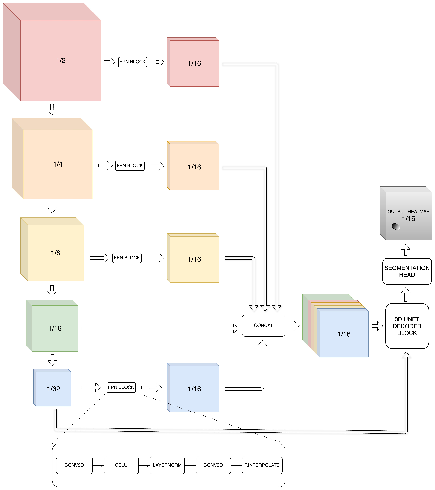

Many thanks to the competition host and Kaggle for another engaging challenge - and big congratulations to all the participants!
Thank you to every one who actively shared insights and notebooks to the community, especially @brendanartley for [the external dataset](https://www.kaggle.com/competitions/byu-locating-bacterial-flagellar-motors-2025/discussion/569921).

As always, I had a great time learning throughout the competition and was fortunate enough to finish in the gold zone. I'm really happy to share a few thoughts here.
  
# TLDR;
- I'm focus on the 3D/2.5D/2D UNet approaches. The final submission PB 86.6 was an ensemble of 5 models: `3D Resnext50 (2xTTA)`, `3D Densenet121 (2xTTA)`, `3D X3D-M (2xTTA)`, `2D MaxViT (2xTTA)` and `2D CoaT (1xTTA)`
- 3D model use patch size of `(224, 448, 448)` while 2D use `(3, 896, 896)` patch size to incorporate enough global context.
- Gaussian heatmap with `stride=16` and `sigma=200A` for uncertainty modeling
- Simple FPN neck to fuse low-level features into stride-16-feature map
- All final selected models are trained on combine of train dataset + external dataset without local validation
- Heavy augmentations allowed to train for more epochs and be more robust to domain/distribution change.
- Pseudo labeling on train+external dataset, with manual review
- Resample all tomograms to 16A voxel spacing + Sliding window patches inference
- Simple BCE loss works best
- Weighted Box Fusion (WBF) to ensemble multiple model/TTA ’s predictions


**What not work**
- Other losses: MSE, L1, Weighted BCE, Focal, Tversky, Combine multiple losses


# Table of Contents


- [TLDR;](#tldr)
- [Table of Contents](#table-of-contents)
- [Validation strategy](#validation-strategy)
- [3D-UNet Approach](#3d-unet-approach)
  - [Data processing](#data-processing)
  - [3D augmentation](#3d-augmentation)
  - [3D target heatmap](#3d-target-heatmap)
  - [3D modeling](#3d-modeling)
    - [3D Encoder](#3d-encoder)
    - [2.5D Encoder](#25d-encoder)
    - [Some results](#some-results)
- [2D-UNet Approach](#2d-unet-approach)
  - [Data processing](#data-processing-1)
  - [2D augmentation](#2d-augmentation)
  - [2D target heatmap](#2d-target-heatmap)
  - [2D modeling](#2d-modeling)
- [External dataset \& Pseudo label](#external-dataset--pseudo-label)
- [Postprocessing](#postprocessing)
- [Source code](#source-code)


---

# Validation strategy
A simple 4-StratifiedKfold by number of motors was conducted on train dataset. Validation samples are augmented by Rotate90+Flip (16 posible combinations) to increase the number of samples, making validation metrics more stable and trustworthy to track.

Experiment progress was tracked using mainly F2 score and additionally Partial Average Precision, cutoff at a specific Recall, e.g > 0.9. The second is not a binary metric so more stable and less sentitive to threshold, strong correlate with F2. Single-fold local CV was the main factor to select models and hyperparameters.

**Train on all data, validate on LB:** However, when my pipeline are bug-free and going better (when CV > 0.96 and LB > 0.8), CV is just saturated and not correlate to LB well. So at the later stage, CV is just used to guide a reasonable value of hyperparameter (mainly learning rate). In last week, all models were trained on all dataset without local validation and are submitted to LB.


# 3D-UNet Approach


## Data processing

I resample tomogram to a fixed voxel spacing of 16.0, use sliding windows (patching) technique, split tomogram to `224x448x448` (possibly overlap) patches as input to models to obtain **16x** downscaled prediction heatmap of shape `14x28x28`.  
The labeling coordinate is a little bit noisy/uncertain, also the tolerance radius is high, so using high heatmap resolution seem to be redundant, significantly increase the computation. `Radius of 1000A` == `62.5 voxels in input volume` == `4 voxels in prediction heatmap`. I've experimented with prediction heatmap of `8x` and `32x` downscaled heatmap and found that `8x` ~ `16x` >> `32x`. To the end, I use `16x` downscaled heatmap for both 3D and 2D models.

**Optimal voxel spacing is ~16.0**  
For this task, resampling to a suitable voxel spacing is important. Using small voxel spacing keep the very small details but computation intensive due to high resolution, in contrast large voxel spacing could erase out all the textures needed for detection. Experiment results confirm that very small detail/textures are matter:

- Tried various target voxel spacing 12, 16, 20, 24, 32, 64; found that CV degrade significantly when spacing > 32. LB also degrade much faster right after spacing > 20. I found 16.0 is the best balance value, matching with the typical [median spacing](https://github.com/MIC-DKFZ/nnUNet/issues/2701) default practice of nnUnet (median spacing is 15.6 for the train dataset).
- Resampling interpolation mode (LINEAR, AREA, NEAREST) also could significantly affect performance. All tomograms are also noisy (Gaussian noise?) so resize/interpolation could erase thing in an unexpected manner.

**The mean original voxel spacing in LB/PB is 13.1 ???**  
Haha, just my stupid guess work and there're no way I could confirm. I trained model with `target_spacing=16.0` and submit to LB with different of assumtions about the original spacing. `13.1` brings the highest LB. Given that test samples have higher resolution (`~400x1400x1050` in average) and 44.7% of train samples have `voxel_spacing=13.1`, **I safely assume that the average test voxel spacing is ~13.1, and resample to 16.0 for all experiments**
> I tried to quickly train a voxel spacing prediction model on the last day, but failed, metric is about `MAE=5.1`, can't predict any useful thing :D

Each sample is dominated by negative voxels, so I try to control the number of positive/negative patches ratio in the training progress. For 3D approach, the positive/negative samples ratio is 20/1.


## 3D augmentation

For each epoch, all positive samples are ensured to be augmented with all 16 transformations composed of Rotate90+Flip, go after a "heavy" MONAI augmentation pipeline. Keypoints passed to MONAI dictionary transform as well so that we get the Affine-transformed keypoints to render the heatmap with larger stride (16 in this case). I really like MONAI's [Lazy Resampling](https://docs.monai.io/en/stable/lazy_resampling.html), which make augmentation and dataloader become fast and efficient.
Various MONAI 3D augmentations were used:
- Spatial: `RandZoom`, `RandAffined`
- Intensity: `RandShiftIntensityd`, `RandStdShiftIntensityd`, `RandScaleIntensityFixedMeand`, `RandScaleIntensityd`, `RandAdjustContrastd`, `RandHistogramShiftd`
- Reduce quality: `RandSimulateLowResolutiond`
- Dropout: `RandCoarseDropoutKeepKeypoints`

Mixup and Cutmix were tried but bring no clear improvement so be ignored in latter experiments.

<details>
<summary>Pseudo code in Albumentations style</summary>

```python
from monai import transforms as T
import monai_custom as CT

T.Compose(
    [
        # =========START OF LAZY RESAMPLING=========
        T.Spacingd(target_spacing=16.0, p=1.0),
        CT.CustomCropBySlicesd(),
        # SPATIAL TRANSFORM
        T.RandZoomd(min_zoom=(0.6, 0.6, 0.6), max_zoom=(1.2, 1.2, 1.2), p=0.4),
        T.OneOf(
            [
                # Affine 1: slight, focus on XY dims
                T.RandAffined(
                    rotate_range=((0, 0), (0, 0), (0, 360)),
                    scale_range=((-0.3, 0.3), (-0.3, 0.3), (-0.3, 0.3)),
                    p=0.67,
                ),
                # Affine2: heavier, focus on all XYZ dims
                T.RandAffined(
                    rotate_range=((-15, 15), (-15, 15), (0, 360)),
                    shear_range=((-0.2, 0.2), (-0.2, 0.2), (-0.2, 0.2)),
                    scale_range=((-0.3, 0.3), (-0.3, 0.3), (-0.3, 0.3)),
                    p=0.33,
                ),
            ],
            p=0.75,
        ),
        # INTENSITY TRANSFORM
        T.OneOf(
            [
                T.Compose(
                    [
                        # mean shift
                        T.OneOf(
                            [
                                T.RandShiftIntensityd(offset=(-40, 80), p=0.5),
                                T.RandStdShiftIntensityd(factors=(-0.7, 1.2), p=0.5),
                            ],
                            p=0.3,
                        ),
                        # std/contrast scale (multiplicative)
                        T.OneOf(
                            [
                                # decrease std/contrast -> harder sample -> higher prob
                                T.RandScaleIntensityFixedMeand(factors=(-0.6, 0), p=0.7),
                                # increase std/contrast -> easier sample -> lower prob
                                T.RandScaleIntensityFixedMeand(factors=(0, 0.8), p=0.3),
                            ],
                            p=0.3,
                        ),
                    ],
                    p=0.4,
                ),
                T.RandScaleIntensityd(factors=(-0.7, 0.7), channel_wise=True, p=0.2),
                T.RandAdjustContrastd(gamma=(0.25, 1.75), p=0.3),
                T.RandHistogramShiftd(num_control_points=(10, 20), p=0.1),
            ],
            p=0.5,
        ),
        # =========END OF LAZY RESAMPLING=========
        # apply Affine Transform to keypoints (normal distributions) as well
        CT.ApplyTransformToNormalDistributionsd(keys=["keypoints"]),
        # with varius interpolation mode pairs, simplified for readability
        T.RandSimulateLowResolutiond(
            zoom_range=(0.6, 0.9), downsample_mode="*", upsample_mode="*", p=0.2
        ),
        CT.RandCoarseDropoutWithKeypointsd(
            keypoints_key="keypoints", holes=3, spatial_size=(30, 30, 30),
            dropout_holes=True, fill_value=(0, 255), max_holes=8,
            max_spatial_size=(125, 125, 125), prob=0.1
        )
    ]
)
```
</details>


## 3D target heatmap
For a task where real distance/scale could be measured, e.g voxel spacing is known, I prefer a fixed sigma measured in real-life distance. Some advances in bottom-up human pose estimation have introduced techniques to adaptively rescale each keypoint's heatmap. Intuitively, these methods adjust the heatmap’s sigma values based on the size of each person, assigning larger/smaller sigmas (higher/lower uncertainty) to larger/smaller ones (relative to their pixel count/box area).

I use a sigma value of 200A (0.2 times the radius). Note that going through Spatial augmentations like Spacing, Affine or Zoom, the voxel spacing is changed so the value of sigma used in rendering the heatmap is not a fixed number of voxels, but rather `0.2 * 1000 / cur_voxel_spacing`.  
A custom implementation of [ApplyTransformToPoints](https://docs.monai.io/en/stable/transforms.html#applytransformtopoints) was implemented to apply Affine Transform to a Normal distribution, result in another Normal distribution to render on the target heatmap volume. Hence, instead of a ball-like shape, each keypoint looks like a rotated ellipsoid.
  


Is this make sense? Maybe not that significant. It's just an assumtion that the likelihood of a motor **strictly** follow a 3D Normal distribution in the original tomogram, which is not likely for this task. Later, I decided to use a ball-like-shape Gaussian heatmap, with diagonal covariance matrix and single sigma for all 3 dimensions ZYX to make life easier for my model (just need to predict the mean and scale, intuitively).

## 3D modeling
3D-UNet with various 3D/2.5D Encoder was tried and be used in final submision. Taking input as a 3D volume of shape `(Z, Y, X) = (224, 448, 448)`, all model predict the output heatmap of shape `(Z/16, Y/16, X/16) = (14, 28, 28)`.  
3D-UNet Decoder borrowed from [segmentation_models_pytorch_3d](https://github.com/ZFTurbo/segmentation_models_pytorch_3d) was tweak to output multiscale heatmaps for ultilizing deep supervision. Since for this task, finest heatmap has stride 16 right after the coarsest one of 32 (not too deep), deep supervision seem to be redundant experimentally, later I just supervise the 1/16 heatmap only.
### 3D Encoder
I mainly tweak and use models from either [timm3d](https://github.com/ZFTurbo/timm_3d) or [SlowFast](https://github.com/facebookresearch/SlowFast). By default, video models like X3D and I3D in SlowFast did not use temporal pooling, keeping the temporal dim unchanged to keep as much as temporal resolution as posible. For this task, this is unnecessary, I make change so that depth (temporal in video term) is progressively downsampled by 2 at each stage, synchronized with spatial downsampling too. Now, all 3D models have the same interface, output at least 4 (usually 5) levels of feature map at stride 1/4, 1/8, 1/16, 1/32.  
As discuss above, we need high resolution (small voxel spacing) for keeping very little details/textures. Standard UNet ultilize and fuse low-level/fine features via skip connection to the same output level. However, UNet with output stride of 16 is not actually U-shape now, hence there're no shorter path to propagate the low-level/fine features (rich texture/localization) to the high-level/coarse output heatmap (rich semantic). Motivated by this, I add necks to fuse low-level features to the coarse output heatmap head, efficiently improve information propagation through the network. Two types of necks were tried:
- Simple 3D FPN Neck: motivated by [this writeup](https://www.kaggle.com/competitions/google-research-identify-contrails-reduce-global-warming/discussion/430491) and [Unified FPN architecture](http://presentations.cocodataset.org/COCO17-Stuff-FAIR.pdf). Simply interpolate features at all level to match spatial shape at stride 1/16, concatenate them all then passed to the UNet Decoder block
- [3D PAN (Path Aggregation Network)](https://arxiv.org/abs/1803.01534): Instead of just adding top-down path augmentation as in [FPN](https://arxiv.org/pdf/1612.03144) to fuse rich semantic features to low-level features at finer scale, we now add another bottom-up path augmentation to fuse rich texture/detail features to the coarser one as well.

It's clear that Simple FPN is a "more straight" way to archive our goal. Not putting much time on this, but my experiment results also confirm that Simple FPN is usually better than PAN. So all my final models were additionally equiped with this Simple FPN neck, illustrated below.  





### 2.5D Encoder
I'm also working with 2.5D encoder, combined with FPN neck and 3D UNet decoder too. The idea is very simple. First we sample a list of 2D 3-channels image by sliding over the depth (Z) dimension with stride of 2, effectively treat one volume as a batch of 2D images. At each stage of 2D backbone, spatial resolution is downsampled by 2 by default, we also down sample the depth (now treated as batch) by a factor of 2 too by either `AvgPool3d((2, 1, 1))` or `Conv3d(stride=(2, 1, 1))`. The first one was better and easier to train since it keep tensor statistics unchanged, better leveraging transfer learning from pretrained 2D backbone. It shows good score if no external dataset was used, significantly reduce overhead at middle/latter stages, being lighweight and helps model effectively "see" all 2D slices of a volume. It's okay for 2D convolution-only backbone such as EfficientNet or ConvNeXT which the heavy computation goes in middle or latter stages, but not for backbone which use Transformer in early stage cause of the high resolution and very large "fake batch size"

Also played with somethings like injecting LSTM layers after obtained 2D features, CV may go up but LB just unchanged. Perhap Conv3d in FPN neck and UNet Decoder was better fusing slicewise features, additional mixing is not necessary anymore.


### Some results
I report LB/PB score of single model (single checkpoint). These models are:
- Trained on all data (train + external)
- 2xTTA: original + rotate 90 along XY plane
- Threshold is the quantile at 55% over all prediction confident scores.

I start using external data a little bit late, so just 1 last checkpoint of them was submitted to obtain LB score with very limitted tuning. Each model's runtime is not exceed 3h.


|       **Model**       | **Params** | **Private LB** | **Public LB** |
|:---------------------:|:----------:|:--------------:|:-------------:|
|      3D RESNEXT50     |    49.9M   |    **86.2**    |      85.8     |
|     3D DENSENET121    |    27.6M   |      85.7      |    **86.0**   |
|       X3DM + FPN      |    10.4M   |      84.6      |      84.8     |
|   X3DM + PAN + MIXUP  |    6.9M    |      84.6      |      84.5     |
|          X3DL         |    12.8M   |      83.9      |      85.2     |
|      3D RESNET50      |    70.3M   |      83.0      |      85.4     |
|  _2.5D CONVNEXT_TINY_ |    40.3M   |      82.4      |      83.7     |
| _2D COAT_LITE_MEDIUM_ |    99.6M   |      83.3      |      84.8     |
|    _2D MAXVIT_TINY_   |    86.1M   |      82.5      |      85.4     |


# 2D-UNet Approach
2D approach was in my plan, but it becomes urgent since I feel that may be many high score public LB may using 2D approaches, especially YOLO. 2 weeks before competition deadline, I started working on 2D modeling and inherrit many details from the 3D one. Training 2D models was much more resource efficient and much faster compared to 3D.

## Data processing
The same target voxel spacing of 16.0 was used too, i.e I resize each 2D slice so that XY spacing is 16A. Of course augmentations could scale this spacing later, but same as 3D approach, sigma of each keypoint is rescaled accordingly so that final sigma is fixed at a real distance of 200A.
In inference stage, I load the full volume on RAM then perform LINEAR interpolation to fixed voxel spacing of `(Z, Y, X) = (32, 16, 16)`, that say sampling along Z (depth) is more sparse. This helps reduce inference cost without too much performance decregation. I use 3 channels image of size `(896, 896)` as input to 2D-UNet model.


In training stage, different from 3D pipeline where I load whole volume to RAM then using MONAI's lazy resampling (using F.grid_sample internally), 2D pipeline just sample a specific value of Z (following truncated normal distribution with scale of 1 sigma) then load 3 nearby images per sample (spacing~32A) from disk, which is pretty efficient. Although 2D approach is more sample efficient to reach a medium score, controlling the positive/negative samples ratio is still important so that model could see more negative slices over all data domain/distribution rather than just the "motor’s neighbor" slices. I started experimenting with negative/positive ratio equal to 0.25, latter found that CV improved quite significantly when set it to 0.75, but not enough submissions to confirm that on LB.

## 2D augmentation
[Albumentations](https://github.com/albumentations-team/albumentations) was used to create augmentation pipeline, with ability to handle and keep track of keypoints scaling as well, which is pretty neat.
<details>
<summary> 2D augmentation code </summary>

```python
TARGET_SPACING = 16.0
PATCH_SIZE = (896, 896)

def _byu_get_safe_bbox(params, data, margin_xy=(100, 100)):
    """Get safe bbox to crop which contain at least 1 motor."""
    del params
    if "keypoints" in data and len(data["keypoints"]) > 0:
        kpt = random.choice(data["keypoints"])
        # x, y, angle, scale
        assert len(kpt) == 9
        x, y = kpt[:2]
        scale = kpt[3]
        return [
            x - margin_xy[0] * scale,
            y - margin_xy[1] * scale,
            x + margin_xy[0] * scale,
            y + margin_xy[1] * scale,
        ]
    else:
        return None


augment_transform = A.Compose(
    [
        # FLIP
        A.HorizontalFlip(p=0.5),
        A.VerticalFlip(p=0.5),
        # NOISE
        A.OneOf(
            [
                A.GaussNoise(
                    var_limit=(60, 120),
                    mean=0,
                    per_channel=True,
                    noise_scale_factor=0.5,
                    p=0.6,
                ),
                A.MultiplicativeNoise(
                    multiplier=(0.6, 1.4),
                    per_channel=True,
                    elementwise=True,
                    p=0.4,
                ),
            ],
            p=0.1,
        ),
        # REDUCE QUALITY
        A.OneOf(
            [
                # jitter on float32, implement AdaptiveDownscale based on current resolution
                A.OneOf(
                    [
                        A.Downscale(
                            scale_range=(0.5, 0.9),
                            interpolation_pair={
                                "upscale": cv2.INTER_LANCZOS4,
                                "downscale": cv2.INTER_AREA,
                            },
                            p=0.1,
                        ),
                        A.Downscale(
                            scale_range=(0.5, 0.9),
                            interpolation_pair={
                                "upscale": cv2.INTER_LINEAR,
                                "downscale": cv2.INTER_AREA,
                            },
                            p=0.1,
                        ),
                        A.Downscale(
                            scale_range=(0.5, 0.9),
                            interpolation_pair={
                                "upscale": cv2.INTER_LINEAR,
                                "downscale": cv2.INTER_LINEAR,
                            },
                            p=0.8,
                        ),
                    ],
                    p=0.6,
                ),
                A.ImageCompression(
                    compression_type="jpeg", quality_range=(20, 80), p=0.3
                ),
                A.Posterize(num_bits=(4, 6), p=0.1),
            ],
            p=0.25,
        ),
        # TEXTURE
        A.OneOf(
            [
                # wrong on float32 img
                A.Emboss(alpha=(0.3, 0.6), strength=(0.2, 0.8), p=0.4),
                A.Sharpen(alpha=(0.1, 0.3), lightness=(0.0, 0.4), p=0.5),
                A.CLAHE(clip_limit=4.0, tile_grid_size=(16, 16), p=0.1),
            ],
            p=0.1,
        ),
        # BRIGHTNESS & CONTRAST
        A.OneOf(
            [
                A.OneOf(
                    [
                        A.RandomBrightnessContrast(
                            brightness_limit=(-0.3, 0.0),
                            contrast_limit=(-0.2, 0.0),
                            brightness_by_max=False,
                            p=0.4,
                        ),
                        A.RandomBrightnessContrast(
                            brightness_limit=(0.0, 0.4),
                            contrast_limit=(-0.5, 0.0),
                            brightness_by_max=False,
                            p=0.4,
                        ),
                        A.RandomBrightnessContrast(
                            brightness_limit=(-0.3, 0.0),
                            contrast_limit=(0.0, 0.5),
                            brightness_by_max=False,
                            p=0.1,
                        ),
                        A.RandomBrightnessContrast(
                            brightness_limit=(0.0, 0.3),
                            contrast_limit=(0.0, 0.5),
                            brightness_by_max=False,
                            p=0.1,
                        ),
                    ],
                    p=0.4,
                ),
                A.RandomToneCurve(scale=0.3, per_channel=True, p=0.4),
                A.RandomGamma(gamma_limit=(60, 150), p=0.2),
            ],
            p=0.5,
        ),
        # GEOMETRIC
        A.OneOf(
            [
                # strong rotate
                A.Affine(
                    scale={"x": (0.6, 1.2), "y": (0.6, 1.2)},
                    translate_percent=None,
                    rotate=(0, 360),
                    shear={"x": (-5, 5), "y": (-5, 5)},
                    interpolation=cv2.INTER_LINEAR,
                    cval=128,
                    mode=cv2.BORDER_CONSTANT,
                    fit_output=True,
                    keep_ratio=False,
                    balanced_scale=False,
                    p=0.4,
                ),
                # strong shear
                A.Affine(
                    scale={"x": (0.6, 1.2), "y": (0.6, 1.2)},
                    translate_percent=None,
                    rotate=(0, 360),
                    shear={"x": (-20, 20), "y": (-20, 20)},
                    interpolation=cv2.INTER_LINEAR,
                    cval=128,
                    mode=cv2.BORDER_CONSTANT,
                    fit_output=True,
                    keep_ratio=False,
                    balanced_scale=False,
                    p=0.3,
                ),
                A.Perspective(
                    scale=(0.05, 0.12),
                    keep_size=False,
                    pad_mode=cv2.BORDER_CONSTANT,
                    pad_val=128,
                    fit_output=True,
                    interpolation=cv2.INTER_LINEAR,
                    p=0.3,
                ),
            ],
            p=0.8,
        ),
        # crop go after geometric to prevent too much information loss
        AC.CustomRandomSizedBBoxSafeCrop(
            crop_size=PATCH_SIZE,
            scale=(0.25, 1.0),  # unused
            ratio=(0.25, 1.5),  # unused
            get_bbox_func=partial(
                _byu_get_safe_bbox,
                margin_xy=(
                    1000.0 / TARGET_SPACING,
                    1000.0 / TARGET_SPACING,
                ),
            ),
            retry=10,
            p=1.0,
        ),
        A.PadIfNeeded(
            *PATCH_SIZE,
            position="top_left",
            border_mode=cv2.BORDER_CONSTANT,
            value=128,
            p=1.0,
        ),
    ],
    p=1.0,
)
```

</details>


## 2D target heatmap
There're many ways to render target heatmap. I do a sweep over 4 kinds of heatmap type with different parameters, and found that the best CV was Gaussian heatmap with peak confident and radius scales smaller when goes far from the Z groudtruth coordinate, same as if we render 3D Gaussian heatmap then take a 2D slice over. `adaptive scaling` > `min=0, max=1` >  `segment` > `point`, which support more that we need to modeling uncertainty better.


## 2D modeling
The model used for 2D modeling was adapted from [this Google Contrails solution writeup](https://www.kaggle.com/competitions/google-research-identify-contrails-reduce-global-warming/discussion/430491), thank authors very much for public their source code. It contains an image encoder, a simple FPN neck to fuse low-level features to `/16` feature map, and an UNet Decoder with Pixel Shuffle block.  
I mainly experiment with different types of 2D encoders including EfficientNet, ConvNeXt, CoaT and MaxViT. No supprising, the Hierachical Convolution-Transformer backbones were perform much better than convolution only, indicated that global context matter and we need a sufficient spatial size for obtaining enough context. In selected final submission, I use 2 2D-UNet models with timm backbones: `maxvit_tiny_tf_512.in1k` and `coat_lite_medium_384.in1k`.

# External dataset & Pseudo label
Again, I must thank @brendanartley for [the external dataset](https://www.kaggle.com/competitions/byu-locating-bacterial-flagellar-motors-2025/discussion/569921), especially in early stage of the competition, and @tatamikenn for [his note](https://www.kaggle.com/competitions/byu-locating-bacterial-flagellar-motors-2025/discussion/575028) on wrong-quantized tomograms.

I started diving into that external dataset to train my final submission a week ago, after ensured that my training/inference pipeline is good enough and bug-free (no?). Without external data, I have a simple ensemble of 3D/2.5D UNet with `PB 0.851 and LB 0.852`.

@brendanartley's [dataset](https://www.kaggle.com/competitions/byu-locating-bacterial-flagellar-motors-2025/discussion/569921) was good, but seem not to be directly usable for my pipeline because of slicing and resizing to a fixed shape and losing voxel spacing information. So I tweak the download script to get my own new version, improve it by pseudo labeling+manual review:
1. Keep track the voxel spacing and other metadata as well
2. Re-spacing using `F.interpolate()` to `target_spacing=max(16.0, ori_spacing)` to save disk space and reduce dataloader overhead in the future. This results in a new **180GB** external dataset.
3. Convert his labels to fit my new version. This could loses some precision of Z coordinate.
4. Use my trained models to inference on these data with low confident threshold of `0.05`. Comparing model prediction results with converted GT to identify TP/TN/FP/FN motors.
5. For TP, simply trust model prediction results rather than the converted GT coordinates
6. Use [CVAT](https://github.com/cvat-ai/cvat) to review and label 188 FN and 55 FP. Labeling it is simple and easy as a tagging process, where the labeler (me) just consider whether a sample is wrong or correct, not finding new ones. Almost all FN are correct (?), meaning models are missing so many motors. Labeling these confused cases is hard, but the F2 metric and "believe in AI models" punishs me to be bias and may label more to positives than usual, especially one without flagellum. This could cause inconsistances with public/private test since host [had clarified](https://www.kaggle.com/competitions/byu-locating-bacterial-flagellar-motors-2025/discussion/579540#3217068) that “more than 80% of the tomograms containing no flagellum the motor is not marked”
7. With same strategy, I also try to correct the labeling errors on the train dataset as well.
8. BOOM! Just re-train models on all dataset with previously discovered hyperparameters

Adding so many external data change the game significantly. Training are more stable and allow for much longer training without overfiting. Though more tunings on new setup are needed, however, the deadline is quickly approaching its final days..


# Postprocessing

As usual, I'm not use a fixed threshold since it's largely change between submitted models to the LB. Instead, just use quantile thresholding at 55% (55% lowest threshold samples are predicted as negative, the remain 45% ones predicted as positive) which is adaptively changed based on model's confident distribution, so just one LB submission is enough to estimate the best F2 score.

The postprocessing process:
- I use 5 models combined with TTAs, output 9 different heatmaps
- Not using heatmap averaging, instead, decode each heatmap into list of candidate keypoints using NMS with 0.2 confident threshold.
- Combine all 9 predictions to get final result using a version of 3D Weighted Box Fusion, using L2 distance for clustering and `conf_mode='avg'`

I didn't conduct many experiments with ensemble methods before, and decided to use WBF on the two last days, just believe that it could survive some very strong peak signal from one single model, thus improve Recall.


# Source code
I'm cleaning my code and will release both train and inference code, maybe on the next day.
- **Training code**: *to be updated*
- **Inference notebook**:  https://www.kaggle.com/code/dangnh0611/3rd-place-solution-submit

Thanks for your attention !
